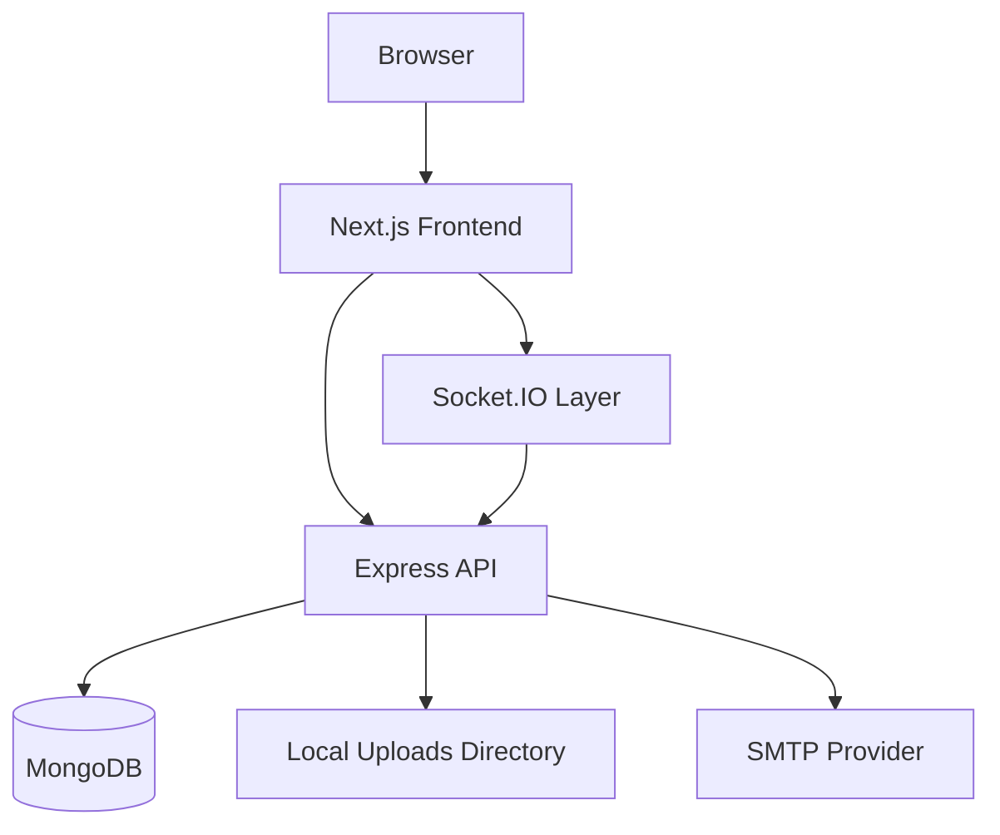
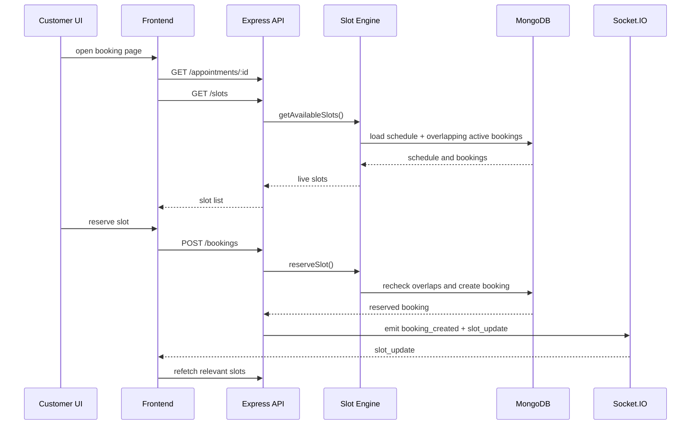

# Schedulix Project Documentation

## 1. Project Overview

Schedulix is a role-based medical appointment scheduling platform for customers, organisers, and admins. It is designed to solve the operational pain around service publishing, provider availability, slot conflicts, booking confirmation, payment tracking, reminders, and customer-facing records.

The current system includes:

- customer service discovery and booking
- organiser-first service creation, editing, publishing, and schedule management
- admin visibility into users, bookings, and analytics
- OTP and email-link verification
- password reset flows
- local image uploads
- real-time slot and booking updates through Socket.IO
- professional PDF booking documents generated on the backend
- automated API coverage for critical auth and booking paths

This document explains:

- what product problems Schedulix solves
- what the MVP is
- how the architecture is organized
- where the major features live in the codebase
- what is production-leaning already
- what still remains as future scope

## 2. Product Goals

Schedulix is built to solve these recurring problems:

1. patients struggle to discover the right service quickly
2. organisers need a clean way to publish and maintain services
3. schedule logic often lives in the UI and causes double-booking risk
4. temporary reservations and confirmations need controlled state transitions
5. customers and organisers need a shared, current view of slot availability
6. payment state and appointment state need to stay visible together
7. operators need records, reports, reminders, and analytics in one place

## 3. Personas and Roles

### Customer

Needs:

- searchable service discovery
- reliable live slot availability
- fast booking with low friction
- visible venue and provider details
- downloadable appointment and payment records

### Organiser

Needs:

- a primary workflow centered on services
- service editing without recreating records
- schedule-backed booking logic
- manual confirmation when needed
- booking visibility and operational control

### Admin

Needs:

- user oversight
- booking and revenue visibility
- trend and utilization analytics
- confidence that core flows are behaving correctly

## 4. MVP Definition

The original MVP for Schedulix is:

- signup and login with account verification
- role-aware routing
- organiser service creation
- schedule-based slot generation
- booking reservation and confirmation
- cancellation and reschedule
- basic payment status tracking

### MVP success criteria

- a customer can discover a service and reserve a valid slot
- an organiser can publish a service with a real schedule
- the system prevents invalid or conflicting reservations
- both sides can see the resulting booking state

## 5. Current Scope Beyond MVP

The repository now goes meaningfully beyond the MVP and includes:

- profile completion gating
- doctor-type-locked organiser specialization
- venue or `Online` service handling
- auto-book first available slot
- next-day suggestion when today is full
- shareable service links
- real-time slot refresh via Socket.IO
- organiser service editing through `PUT /appointments/:id`
- backend-generated PDF downloads with Puppeteer
- lifecycle emails and reminder loop
- analytics dashboards
- Jest + Supertest coverage for critical API behavior

## 6. System Architecture

### 6.1 Runtime architecture

### 6.2 Backend architecture

The backend follows a clear layered structure:

1. `routes/` expose endpoint surfaces
2. `controllers/` orchestrate requests and responses
3. `models/` define persisted data
4. `utils/` hold domain logic such as slots, tokens, email, PDF generation, and uploads
5. `middleware/` applies auth and role enforcement
6. `socket.js` exposes the real-time layer

Key entrypoints:

- `schedulix-backend/src/app.js`
- `schedulix-backend/src/server.js`
- `schedulix-backend/src/socket.js`

### 6.3 Frontend architecture

The frontend uses Next.js App Router with role-based route groups:

- `(auth)` for signup, login, verification, and reset
- `(customer)` for browse, book, confirm, pay, bookings, and profile
- `(organiser)` for dashboard, services, bookings, and calendar
- `(admin)` for analytics and management

Shared frontend foundations:

- `schedulix-frontend/lib/api.js`
- `schedulix-frontend/lib/authStore.js`
- `schedulix-frontend/lib/socket.js`
- `schedulix-frontend/components/*`

## 7. Data Model

### User

File: `schedulix-backend/src/models/User.js`

Important fields:

- `role`
- `isActive`
- `doctorType`
- `medicalRegistrationNo`
- `profileImageUrl`

### AppointmentType

File: `schedulix-backend/src/models/AppointmentType.js`

Important fields:

- `title`
- `description`
- `venue`
- `specialization`
- `duration`
- `manualConfirmation`
- `advancePayment`
- `feeAmount`
- `shareToken`
- `isPublished`

### Schedule

File: `schedulix-backend/src/models/Schedule.js`

Purpose:

- stores weekly or flexible availability windows
- drives all live slot generation

### Booking

File: `schedulix-backend/src/models/Booking.js`

Important fields:

- `status`
- `paymentStatus`
- `reservedAt`
- `problemImageUrl`
- `answers`
- `rescheduledFrom`

Important behavior:

- reserved bookings expire automatically after 5 minutes via TTL index

## 8. Route Map

### 8.1 Backend API route groups

| Route Group | Purpose | Main Files |
|---|---|---|
| `/auth` | signup, verification, login, password reset | `src/routes/auth.routes.js`, `src/controllers/auth.controller.js` |
| `/profile` | profile read and update | `src/routes/profile.routes.js`, `src/controllers/profile.controller.js` |
| `/appointments` | service create, update, publish, schedule, share | `src/routes/appointment.routes.js`, `src/controllers/appointment.controller.js` |
| `/slots` | live slot listing and recommendations | `src/routes/slot.routes.js`, `src/controllers/slot.controller.js` |
| `/bookings` | reserve, confirm, cancel, reschedule, payment, PDF | `src/routes/booking.routes.js`, `src/controllers/booking.controller.js` |
| `/admin` | analytics and platform visibility | `src/routes/admin.routes.js`, `src/controllers/admin.controller.js` |
| `/uploads` | image upload metadata and static serving | `src/routes/upload.routes.js`, `src/controllers/upload.controller.js`, `src/utils/uploads.js` |

### 8.2 Frontend page groups

| Area | Purpose | Example Files |
|---|---|---|
| Landing | public first screen with role-aware redirect | `schedulix-frontend/app/page.jsx` |
| Auth | signup/login/verify/reset | `schedulix-frontend/app/(auth)/*/page.jsx` |
| Customer | browse, book, confirm, pay, profile, bookings | `schedulix-frontend/app/(customer)/*/page.jsx` |
| Organiser | dashboard, services, edit flow, bookings, calendar | `schedulix-frontend/app/(organiser)/organiser/*/page.jsx` |
| Admin | analytics and user management | `schedulix-frontend/app/(admin)/admin/*/page.jsx` |
| Share | direct public booking links | `schedulix-frontend/app/share/[token]/page.jsx` |

## 9. Core Features, Problems Solved, and File Ownership

| Problem Solved | How It Is Solved | Main Files |
|---|---|---|
| Account trust and fake signup risk | OTP and email-link verification before activation | `schedulix-backend/src/controllers/auth.controller.js`, `schedulix-backend/src/utils/email.js`, `schedulix-frontend/app/(auth)/verify-otp/page.jsx`, `schedulix-frontend/app/(auth)/verify-link/page.jsx` |
| Password recovery | OTP and link-based reset flows | `schedulix-backend/src/controllers/auth.controller.js`, `schedulix-frontend/app/(auth)/forgot-password/page.jsx`, `schedulix-frontend/app/(auth)/reset-password/page.jsx` |
| Role isolation | JWT auth, role middleware, persisted client auth state | `schedulix-backend/src/middleware/auth.middleware.js`, `schedulix-backend/src/middleware/role.middleware.js`, `schedulix-frontend/lib/authStore.js` |
| Weak organiser identity data | profile completion and role-aware medical fields | `schedulix-backend/src/utils/helpers.js`, `schedulix-backend/src/controllers/profile.controller.js`, `schedulix-frontend/components/ProfileForm.jsx` |
| Organisers creating mismatched service types | specialization is locked to the organiser doctor type | `schedulix-backend/src/controllers/appointment.controller.js`, `schedulix-backend/src/models/AppointmentType.js`, `schedulix-frontend/lib/medical.js`, `schedulix-frontend/components/AppointmentEditorForm.jsx` |
| Missing venue clarity | venue is required logically and can fall back to `Online` | `schedulix-backend/src/controllers/appointment.controller.js`, `schedulix-frontend/components/AppointmentEditorForm.jsx`, `schedulix-frontend/app/(customer)/my-bookings/page.jsx` |
| Organiser workflow feeling secondary | organiser dashboard is the role home and highlights create, edit, and manage schedule actions | `schedulix-frontend/lib/authStore.js`, `schedulix-frontend/app/page.jsx`, `schedulix-frontend/app/(organiser)/organiser/dashboard/page.jsx` |
| Media not rendering reliably | uploads are served from backend and URLs are normalized in the client | `schedulix-backend/src/app.js`, `schedulix-backend/src/utils/uploads.js`, `schedulix-frontend/lib/media.js`, `schedulix-frontend/components/ImageUploadField.jsx` |
| Static or fake availability | slots are generated on the server from persisted schedules | `schedulix-backend/src/utils/slotEngine.js`, `schedulix-backend/src/controllers/slot.controller.js`, `schedulix-frontend/components/BookingWorkspace.jsx` |
| Double booking | slot conflicts are rechecked server-side before the booking write succeeds | `schedulix-backend/src/utils/slotEngine.js`, `schedulix-backend/src/controllers/booking.controller.js` |
| Reserved slot leakage | reserved bookings expire through a TTL-backed reservation window | `schedulix-backend/src/models/Booking.js`, `schedulix-backend/src/controllers/booking.controller.js` |
| Slow manual slot hunting | earliest-slot recommendation and auto-book behavior | `schedulix-backend/src/utils/slotEngine.js`, `schedulix-backend/src/controllers/slot.controller.js`, `schedulix-frontend/components/BookingWorkspace.jsx` |
| Stale multi-user slot UI | `booking_created`, `booking_cancelled`, and `slot_update` events trigger automatic refetches | `schedulix-backend/src/socket.js`, `schedulix-backend/src/controllers/booking.controller.js`, `schedulix-frontend/lib/socket.js`, `schedulix-frontend/components/BookingWorkspace.jsx`, `schedulix-frontend/app/(customer)/my-bookings/page.jsx` |
| Organisers needing a maintenance path, not just creation | services can be updated with `PUT /appointments/:id` and edited in a shared organiser editor | `schedulix-backend/src/controllers/appointment.controller.js`, `schedulix-frontend/components/AppointmentEditorForm.jsx`, `schedulix-frontend/app/(organiser)/organiser/appointments/[id]/page.jsx` |
| Weak booking records | appointment and payment documents are generated as A4 PDFs on the backend | `schedulix-backend/src/utils/pdfGenerator.js`, `schedulix-backend/src/controllers/booking.controller.js`, `schedulix-frontend/lib/receipts.js` |
| Reliability being hard to demonstrate | auth, booking, conflict, and PDF route behavior are covered with tests | `schedulix-backend/tests/auth.test.js`, `schedulix-backend/tests/booking.test.js`, `schedulix-backend/tests/conflict.test.js` |
| Limited operational visibility | dashboard metrics, charts, and booking insights for organisers and admins | `schedulix-backend/src/controllers/admin.controller.js`, `schedulix-backend/src/controllers/booking.controller.js`, `schedulix-frontend/app/(organiser)/organiser/dashboard/page.jsx`, `schedulix-frontend/app/(admin)/admin/analytics/page.jsx` |

## 10. Booking Engine Architecture

Primary file:

- `schedulix-backend/src/utils/slotEngine.js`

Responsibilities:

- validate requested date ranges
- resolve the schedule for an appointment type and provider
- expand schedule windows into concrete slot objects
- compute overlap and remaining capacity
- recommend best or earliest slots
- reserve a slot inside a safe write flow

### Booking flow sequence

## 11. Frontend Module Breakdown

### 11.1 Shared libraries

| File | Responsibility |
|---|---|
| `schedulix-frontend/lib/api.js` | Axios instance, base URL, auth header injection |
| `schedulix-frontend/lib/authStore.js` | persisted auth state, booking draft, selected booking |
| `schedulix-frontend/lib/format.js` | currency and datetime formatting |
| `schedulix-frontend/lib/media.js` | upload/media URL normalization |
| `schedulix-frontend/lib/medical.js` | doctor type and specialization helpers |
| `schedulix-frontend/lib/socket.js` | shared Socket.IO client connection |
| `schedulix-frontend/lib/receipts.js` | backend PDF download helpers |
| `schedulix-frontend/lib/uploads.js` | multipart upload helper |

### 11.2 Shared components

| File | Responsibility |
|---|---|
| `components/Navbar.jsx` | top-level navigation and current-user avatar |
| `components/Footer.jsx` | shared footer |
| `components/ProfileForm.jsx` | role-aware profile editor |
| `components/ImageUploadField.jsx` | reusable image upload UI |
| `components/AppointmentEditorForm.jsx` | organiser service create/edit experience |
| `components/BookingWorkspace.jsx` | slot selection, auto-book, and live slot refresh |
| `components/BookingForm.jsx` | intake question and problem-photo confirmation form |
| `components/SlotGrid.jsx` | selectable slot grid |
| `components/PaymentButtons.jsx` | payment action buttons |
| `components/Chart.jsx` | dashboard graph card |

## 12. Backend Module Breakdown

### 12.1 Controllers

| File | Responsibility |
|---|---|
| `auth.controller.js` | signup, verify, login, forgot/reset password |
| `profile.controller.js` | read/update profile and organiser medical metadata |
| `appointment.controller.js` | create service, update service, publish, share, schedule upsert |
| `slot.controller.js` | list available slots and recommendations |
| `booking.controller.js` | reserve, confirm, cancel, reschedule, payment, insights, PDF download |
| `admin.controller.js` | stats, analytics, system-wide summaries |
| `upload.controller.js` | upload metadata and public URLs |

### 12.2 Utilities and infrastructure

| File | Responsibility |
|---|---|
| `helpers.js` | generic helpers, user serialization, profile completeness |
| `slotEngine.js` | slot math and reservation logic |
| `pdfGenerator.js` | Puppeteer-based A4 PDF generation |
| `socket.js` | Socket.IO initialization and emit helpers |
| `uploads.js` | multer storage and media URL generation |
| `email.js` | email transport and reusable HTML templates |
| `bookingNotifications.js` | lifecycle emails and reminder loop |
| `token.js` | JWT, OTP, and token generation |
| `seedAdmin.js` | default admin bootstrap |

## 13. Real-Time Architecture

The real-time layer exists to keep slot availability trustworthy across simultaneous users.

### Backend pieces

- `schedulix-backend/src/server.js`
- `schedulix-backend/src/socket.js`
- `schedulix-backend/src/controllers/booking.controller.js`
- `schedulix-backend/src/controllers/appointment.controller.js`

### Frontend pieces

- `schedulix-frontend/lib/socket.js`
- `schedulix-frontend/components/BookingWorkspace.jsx`
- `schedulix-frontend/app/(customer)/my-bookings/page.jsx`
- `schedulix-frontend/app/(organiser)/organiser/dashboard/page.jsx`
- `schedulix-frontend/app/(organiser)/organiser/bookings/page.jsx`

### Events emitted

- `booking_created`
- `booking_cancelled`
- `slot_update`

### Why this matters

Without push updates, one user can book a slot while another user still sees it as open. The new socket layer closes that gap by prompting affected screens to refetch live slot data immediately.

## 14. PDF Download Architecture

The system now generates booking documents on the backend with Puppeteer instead of composing them client-side.

### Files

- `schedulix-backend/src/utils/pdfGenerator.js`
- `schedulix-backend/src/controllers/booking.controller.js`
- `schedulix-backend/src/routes/booking.routes.js`
- `schedulix-frontend/lib/receipts.js`

### Flow

1. the frontend requests `GET /bookings/:id/pdf`
2. the booking controller loads the booking with provider, customer, and service context
3. `generateBookingPDF()` renders styled HTML
4. Puppeteer exports the document as an A4 PDF buffer
5. the browser downloads the resulting PDF

### Current document types

- booking confirmation / appointment report
- payment receipt

## 15. Automated Test Coverage

Test stack:

- Jest
- Supertest

Files:

- `schedulix-backend/jest.config.js`
- `schedulix-backend/tests/setupEnv.js`
- `schedulix-backend/tests/setupDb.js`
- `schedulix-backend/tests/auth.test.js`
- `schedulix-backend/tests/booking.test.js`
- `schedulix-backend/tests/conflict.test.js`

Covered flows:

- signup
- OTP verification + login
- create booking
- confirm booking
- download booking PDF
- prevent double booking

Why this matters:

- it demonstrates that the core promise of the platform is reliable
- it gives fast regression checks on the booking lifecycle
- it provides a clean demo story for backend quality

## 16. Security and Validation

Current safety controls:

- bcrypt password hashing
- JWT-protected routes
- role-based middleware
- request validation in controllers and utility helpers
- rate limiting via `express-rate-limit`
- security headers via `helmet`
- MIME and file-size checks on uploads
- server-side slot validation before reservation write
- TTL cleanup for stale reservations

Main files:

- `schedulix-backend/src/app.js`
- `schedulix-backend/src/middleware/auth.middleware.js`
- `schedulix-backend/src/middleware/role.middleware.js`
- `schedulix-backend/src/utils/helpers.js`
- `schedulix-backend/src/utils/uploads.js`

## 17. Environment Configuration

### Backend variables

| Variable | Purpose |
|---|---|
| `NODE_ENV` | runtime mode |
| `PORT` | API port |
| `MONGO_URI` | MongoDB connection string |
| `JWT_SECRET` | JWT signing secret |
| `JWT_EXPIRES_IN` | token lifetime |
| `API_BASE_URL` | backend public base URL |
| `CLIENT_BASE_URL` | frontend public base URL |
| `CORS_ORIGIN` | allowed browser origins |
| `EMAIL_FROM` | email sender identity |
| `SMTP_HOST`, `SMTP_PORT`, `SMTP_SECURE`, `SMTP_USER`, `SMTP_PASS` | SMTP settings |
| `BCRYPT_SALT_ROUNDS` | hashing cost |
| `DEFAULT_ADMIN_*` | seeded admin bootstrap |

### Frontend variables

| Variable | Purpose |
|---|---|
| `NEXT_PUBLIC_API_BASE_URL` | browser-visible API base URL |

## 18. Known Limitations

The system is stronger than a simple MVP, but some limits remain:

- payment handling is still mock/manual, not a gateway integration
- uploads are stored locally, not on cloud object storage
- the organiser editor is optimized for the main weekly scheduling pattern, not advanced exception builders
- socket events are broadcast globally and can later be refined into room-scoped subscriptions
- automated tests focus on high-value API flows, not full frontend coverage

## 19. Suggested Roadmap

### Product

- richer schedule exceptions and blackout dates UI
- branded PDF templates with logos and invoice details
- deeper patient history and appointment timeline views
- provider-side schedule exception management

### Engineering

- room-scoped websocket subscriptions
- frontend component and flow tests
- payment provider integration
- cloud media storage
- broader booking reminder and expiry test coverage
- deployment manifests and example environment files

## 20. Final Summary

Schedulix is not just CRUD over appointments. Its value comes from combining:

- server-side schedule and slot computation
- controlled booking state transitions
- organiser-first service management
- real-time availability updates
- portable booking records
- clear role-based architecture

If someone needs to understand the heart of the product fast, start here:

- `schedulix-backend/src/utils/slotEngine.js`
- `schedulix-backend/src/controllers/booking.controller.js`
- `schedulix-backend/src/controllers/appointment.controller.js`
- `schedulix-backend/src/socket.js`
- `schedulix-frontend/components/BookingWorkspace.jsx`
- `schedulix-frontend/components/AppointmentEditorForm.jsx`
