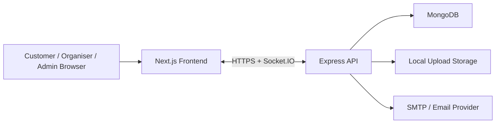

# Schedulix

Schedulix is a full-stack medical appointment scheduling platform with role-based workspaces for customers, organisers, and admins. It combines service publishing, slot generation, temporary reservation, real-time availability sync, confirmation, payments, uploads, analytics, reminders, and professional downloadable booking documents in one project.

This repository contains:

- `schedulix-frontend`: Next.js frontend
- `schedulix-backend`: Express + MongoDB backend
- `DESIGN.md`: UI and product design notes
- `PROJECT_DOCUMENTATION.md`: full engineering and product documentation

## What Schedulix Does

Schedulix solves the messy parts of appointment coordination:

- discovering relevant medical services
- matching patients to valid provider availability
- preventing double-booking with server-side slot checks
- holding a slot briefly while the customer confirms details
- supporting instant confirmation or organiser review
- recording payments and generating downloadable booking documents
- emailing verification, password reset, booking updates, and reminders
- giving organisers and admins visibility into scheduling activity

## User Roles

### Customer

- browse published services
- search by service, provider, specialty, or venue
- reserve a live slot
- auto-book the first available slot
- confirm intake answers
- upload problem photos
- pay for advance-payment services
- download appointment and payment PDFs
- manage profile and bookings

### Organiser

- complete medical profile
- create services
- publish services with venue or online consultation
- manage recurring schedules
- review bookings and uploaded problem photos
- confirm or reject manual bookings
- see organiser dashboard and calendar

### Admin

- monitor system activity
- review users
- see analytics and booking trends
- view provider utilization and system graphs

## Core Capabilities

- email OTP verification and password reset
- role-based authentication and protected routes
- profile completion workflow
- organiser doctor-type-aware service specialization
- venue-aware service creation with `Online` fallback
- local image uploads for profiles, services, and problem photos
- live slot generation from weekly or flexible schedules
- 5-minute reservation window backed by TTL expiry
- manual confirmation and advance payment support
- shareable service booking links
- reminder email loop for upcoming appointments
- Socket.IO-powered live slot refresh
- backend-generated PDF downloads for appointment reports and payment receipts
- Jest + Supertest coverage for auth and booking-critical flows

## High-Level Architecture



### Frontend

- Next.js App Router application
- Zustand for persisted auth and booking state
- Axios API client for backend communication
- Tailwind CSS + shared UI components

Key frontend files:

- `schedulix-frontend/app/layout.jsx`
- `schedulix-frontend/lib/api.js`
- `schedulix-frontend/lib/authStore.js`
- `schedulix-frontend/lib/socket.js`
- `schedulix-frontend/components/BookingWorkspace.jsx`
- `schedulix-frontend/components/AppointmentEditorForm.jsx`
- `schedulix-frontend/lib/receipts.js`

### Backend

- Express application with route/controller separation
- MongoDB models for users, services, schedules, and bookings
- slot engine for availability generation and booking conflict checks
- Socket.IO event layer for live booking and slot updates
- Puppeteer for backend PDF generation
- nodemailer integration for transactional emails
- multer-based local image upload handling

Key backend files:

- `schedulix-backend/src/app.js`
- `schedulix-backend/src/server.js`
- `schedulix-backend/src/socket.js`
- `schedulix-backend/src/controllers/*.js`
- `schedulix-backend/src/models/*.js`
- `schedulix-backend/src/utils/slotEngine.js`
- `schedulix-backend/src/utils/pdfGenerator.js`
- `schedulix-backend/src/utils/bookingNotifications.js`
- `schedulix-backend/tests/*.test.js`

## Tech Stack

### Frontend

- Next.js 15
- React 19
- Zustand
- Axios
- Socket.IO Client
- Tailwind CSS
- Lucide React

### Backend

- Node.js 20+
- Express 4
- MongoDB + Mongoose
- JSON Web Tokens
- bcrypt
- multer
- nodemailer
- Socket.IO
- Puppeteer
- Jest
- Supertest
- helmet, cors, morgan, express-rate-limit

## Repository Structure

```text
schedulix/
|-- README.md
|-- DESIGN.md
|-- PROJECT_DOCUMENTATION.md
|-- schedulix-backend/
|   |-- package.json
|   `-- src/
|       |-- app.js
|       |-- server.js
|       |-- config/
|       |-- controllers/
|       |-- middleware/
|       |-- models/
|       |-- routes/
|       `-- utils/
`-- schedulix-frontend/
    |-- package.json
    |-- app/
    |-- components/
    |-- lib/
    `-- styles/
```

## Setup

### 1. Install dependencies

Backend:

```bash
cd schedulix-backend
npm install
```

Frontend:

```bash
cd schedulix-frontend
npm install
```

### 2. Configure environment variables

Backend `.env`:

```env
NODE_ENV=development
PORT=5000
MONGO_URI=mongodb://localhost:27017/schedulix
JWT_SECRET=replace_with_a_secure_secret
JWT_EXPIRES_IN=7d
API_BASE_URL=http://localhost:5000
CLIENT_BASE_URL=http://localhost:3000
CORS_ORIGIN=*
EMAIL_FROM="Schedulix <no-reply@example.com>"
SMTP_HOST=
SMTP_PORT=587
SMTP_SECURE=false
SMTP_USER=
SMTP_PASS=
BCRYPT_SALT_ROUNDS=12
DEFAULT_ADMIN_ENABLED=true
DEFAULT_ADMIN_NAME=Admin
DEFAULT_ADMIN_EMAIL=admin@schedulix.local
DEFAULT_ADMIN_PASSWORD=admin@123
```

Frontend `.env.local`:

```env
NEXT_PUBLIC_API_BASE_URL=http://localhost:5000
```

### 3. Run the app

Backend:

```bash
cd schedulix-backend
npm run dev
```

Frontend:

```bash
cd schedulix-frontend
npm run dev
```

Default local URLs:

- frontend: `http://localhost:3000`
- backend: `http://localhost:5000`

## Scripts

### Backend

- `npm run dev`: run API with nodemon
- `npm start`: run API with node
- `npm test`: run Jest + Supertest coverage

### Frontend

- `npm run dev`: run Next.js dev server
- `npm run build`: create production build
- `npm run start`: run production server
- `npm run lint`: run Next lint

## Main Workflows

### Customer booking flow

1. Sign up and verify with OTP or verification link.
2. Browse or search services on `/home`.
3. Open a service booking page.
4. View live slots for the selected day.
5. Either pick a slot manually or auto-book the earliest available one.
6. Confirm intake details and optional problem image.
7. Pay if advance payment is required.
8. Download appointment report and payment receipt as PDF.

### Organiser publishing flow

1. Sign up as organiser.
2. Complete medical credentials in profile.
3. Create a service with venue or `Online`.
4. Specialization is restricted to the organiser doctor type.
5. Define or edit recurring weekly schedule.
6. Publish or unpublish the service.
7. Manage services from the organiser-first dashboard entry point.
8. Review bookings from organiser dashboard, bookings page, and calendar.

### Admin flow

1. Review user accounts.
2. Inspect system-wide counts, revenue, utilization, and trends.
3. Monitor operational health through analytics pages.

## Key Implementation Highlights

- real slot availability is generated on the server from schedule data, not hardcoded in the UI
- overlapping bookings are checked server-side before reservation is created
- reserved bookings expire automatically after 5 minutes through a MongoDB TTL index
- image uploads are stored locally and served from the backend
- slot availability changes are pushed over Socket.IO so stale slot cards disappear quickly
- appointment and payment documents are rendered as backend-generated A4 PDFs through Puppeteer
- transactional email templates are rendered in reusable HTML layouts
- critical auth and booking flows are covered with Jest + Supertest

## Important Files to Know

| Concern | File |
|---|---|
| Express app wiring | `schedulix-backend/src/app.js` |
| Backend startup | `schedulix-backend/src/server.js` |
| WebSocket layer | `schedulix-backend/src/socket.js`, `schedulix-frontend/lib/socket.js` |
| Auth flows | `schedulix-backend/src/controllers/auth.controller.js` |
| Appointment creation, editing, publishing | `schedulix-backend/src/controllers/appointment.controller.js` |
| Booking lifecycle and PDF download route | `schedulix-backend/src/controllers/booking.controller.js` |
| Slot generation and reservation | `schedulix-backend/src/utils/slotEngine.js` |
| PDF rendering | `schedulix-backend/src/utils/pdfGenerator.js` |
| Booking emails and reminders | `schedulix-backend/src/utils/bookingNotifications.js` |
| Frontend API client | `schedulix-frontend/lib/api.js` |
| Frontend auth state | `schedulix-frontend/lib/authStore.js` |
| Booking UI and live slot refresh | `schedulix-frontend/components/BookingWorkspace.jsx` |
| Organiser service editor | `schedulix-frontend/components/AppointmentEditorForm.jsx` |
| Receipt download helpers | `schedulix-frontend/lib/receipts.js` |
| Automated API tests | `schedulix-backend/tests/auth.test.js`, `schedulix-backend/tests/booking.test.js`, `schedulix-backend/tests/conflict.test.js` |

## Current Product State

Schedulix is beyond a bare MVP. The current build includes:

- working auth and verification
- customer, organiser, and admin role separation
- organiser-first service publishing, editing, and schedule-backed slot generation
- booking reservation, confirmation, reschedule, and cancellation
- real-time slot and booking refresh
- payment status recording
- professional backend PDF exports
- automated API tests for critical flows
- analytics and reminder emails

Still important to know:

- payment handling is mock/manual, not a live payment gateway integration
- uploads are stored locally, not on cloud object storage
- tests assume a reachable MongoDB instance for local execution

## Documentation

- product and engineering deep dive: [PROJECT_DOCUMENTATION.md](./PROJECT_DOCUMENTATION.md)
- design language and UI direction: [DESIGN.md](./DESIGN.md)

## Recommended Next Steps

- move uploads to cloud storage
- integrate a real payment provider
- add richer schedule exception tooling on top of the weekly editor
- expand automated coverage to reminder flows, payment edge cases, and slot expiry
